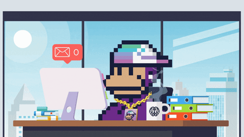

# 👋🏻 Iaee, bom ver você por aqui!  

---
- 🔭 Hoje trabalho com planejamento logístico
- 🌱 Sou estudante de engenharia de produção
- 👨🏻‍💻 Aprendendo algo sobre MS Fabric
- 💭 Vamos viver nossos sonhos, temos tão pouco tempo

<!-- 

 &nbsp;

-->
---

